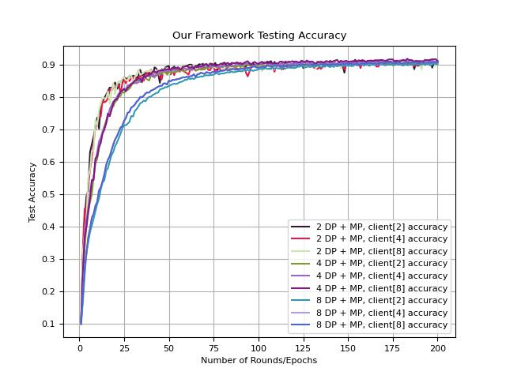
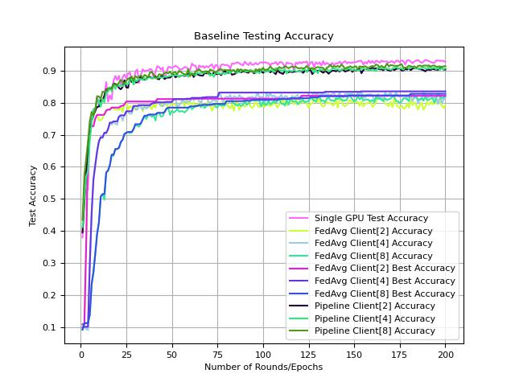
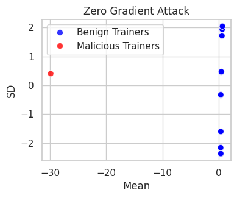
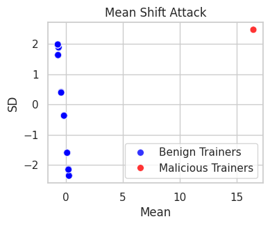
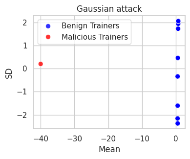

# TDML - A Trustworthy Distributed Machine Learning Framework

This demonstration showcases the research in the paper of 'TDML - A Trustworthy Distributed Machine Learning Framework'. While we aim to share the framework's core functionality, the stakeholders have decided to pursue a patent. Consequently, only essential demonstration code related to the paper can be made publicly available at this time. We hope this provides valuable context and understanding of TDML's capabilities.

## Performance

The following diagrams show our framework performance based on the ResNet-50 with the CIFAR-10 dataset. Since our framework includes data parallelism (DP) and pipeline model parallelism (MP) for large model training, the report schema has two parts: (i) [m] DP and (ii) MP client[N]. The first part, similar to FedAvg, divides the dataset into M pieces with independent model training and aggregates the local models into a global model after each epoch. The second part, MP client[$N$], represents the pipeline model parallelism training where the entire model is split into $N$ shards to ease memory requirements. For example, "2 DP + MP, client[2]" means the training set is divided into two with independent models, and each model is split into two shards across two computing nodes. 

<table>
  <tr>
    <td style="text-align: center;">
       
      <b>Figure 1: Our framework's testing accuracy</b>
    </td>
    <td style="text-align: center;">
       
      <b>Figure 2: Baseline testing accuracy</b>
    </td>
  </tr>
</table>

<table>
  <tr>
    <td style="text-align: center;">
       
      <b>Figure 3: Our framework’s training loss</b>
    </td>
    <td style="text-align: center;">
       
      <b>Figure 4: Baseline training loss</b>
    </td>
  </tr>
</table>

Our model achieves a similar performance of 90% accuracy to that of a single computing node, as shown in Figure 1. However, similar to the issues faced with FedAvg DP, a larger number of DP negatively impacts convergence performance. The blue line (8 DP + MP, client[8]) shows lower accuracy than setups with fewer DPs, reaching 90% accuracy after 100 epochs, whereas others achieve this after 75 epochs.

We designed a two-stage malicious discovery process inspired by the
MANDERA method and illustrated the behavior for various types of attacks, including Gaussian attacks, Zero gradient attacks, and Mean shift attacks. Our malicious discovery method and cross-validation mechanism efficiently identify suspicious attacking nodes while verifying the work of computing nodes for the reward system.

<table>
  <tr>
    <td style="text-align: center;">
       
      <b>Figure 1: Zero gradient attack</b>
    </td>
    <td style="text-align: center;">
       
      <b>Figure 2: Mean shift attack</b>
    </td>
    <td style="text-align: center;">
       
      <b>Figure 3: Gaussian attack</b>
    </td>
  </tr>
</table>

## Requirements

- Python >= 3.11
- PyTorch >= 2.2

Further information will be shared soon.

